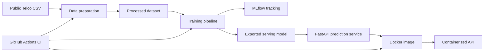

# Customer Churn MLOps

[](https://github.com/akhilakavaram/customer-churn-mlops/actions/workflows/ci.yml)

An end-to-end MLOps project that trains, tracks, packages, tests, and serves a customer churn prediction model.

The project predicts whether a telecom customer is likely to churn using the public IBM Telco Customer Churn dataset. The focus is not only model accuracy. The main goal is to show a production-style ML workflow: reproducible data preparation, experiment tracking, model artifact export, API serving, Docker packaging, and CI validation.

## What This Demonstrates

- Reproducible data preprocessing from raw CSV to processed training data
- Baseline ML training with a full scikit-learn preprocessing and model pipeline
- MLflow experiment tracking for parameters, metrics, and model artifacts
- Portable model export for API serving
- FastAPI inference service with request validation
- Dockerized model API
- GitHub Actions CI that rebuilds the pipeline and Docker image

## Architecture



## Tech Stack

- Python 3.13
- pandas, scikit-learn
- MLflow
- FastAPI, Uvicorn
- Docker
- pytest
- GitHub Actions

## Project Structure

```text
customer-churn-mlops/
  .github/workflows/      # CI workflow
  configs/                # YAML config files
  data/
    raw/                  # Local raw data, ignored by Git
    processed/            # Local processed data, ignored by Git
  models/                 # Exported serving model, ignored by Git
  src/
    api/                  # FastAPI app
    data/                 # Data preparation code
    features/             # Feature engineering placeholder
    models/               # Training and prediction code
  tests/                  # Automated tests
  Dockerfile              # API container image
  requirements-api.txt    # Linux-safe API runtime dependencies
  requirements-dev.txt    # Linux-safe CI/test dependencies
  requirements.txt        # Local Windows development environment
```

## Setup

Create and activate a virtual environment:

```powershell
python -m venv .venv
.\.venv\Scripts\Activate.ps1
python -m pip install -r requirements.txt
```

If PowerShell blocks activation scripts, allow scripts for the current user:

```powershell
Set-ExecutionPolicy -Scope CurrentUser -ExecutionPolicy RemoteSigned
```

## Data

Download the public Telco churn dataset:

```powershell
Invoke-WebRequest `
  -Uri "https://raw.githubusercontent.com/IBM/telco-customer-churn-on-icp4d/master/data/Telco-Customer-Churn.csv" `
  -OutFile "data\raw\telco_customer_churn.csv"
```

Prepare the dataset:

```powershell
python -m src.data.prepare_data
```

Output:

```text
data/processed/churn_cleaned.csv
```

## Training

Train the baseline model:

```powershell
python -m src.models.train_model
```

The training script:

- loads the processed dataset
- splits train/test data
- builds a scikit-learn pipeline with preprocessing and logistic regression
- logs parameters and metrics to MLflow
- exports a portable serving model to `models/customer_churn_pipeline`

Open MLflow:

```powershell
mlflow ui --backend-store-uri sqlite:///mlflow.db
```

Then visit:

```text
http://127.0.0.1:5000
```

## Local Prediction

Run a sample prediction without the API:

```powershell
python -m src.models.predict_model
```

Example output:

```text
Loaded MLflow run ID: ...
Prediction: 0
Churn probability: 0.4321
```

## API

Start the FastAPI app:

```powershell
uvicorn src.api.main:app --reload
```

Open the interactive docs:

```text
http://127.0.0.1:8000/docs
```

Health check:

```text
GET /health
```

Prediction endpoint:

```text
POST /predict
```

Sample request:

```json
{
  "gender": "Female",
  "SeniorCitizen": 0,
  "Partner": "Yes",
  "Dependents": "No",
  "tenure": 1,
  "PhoneService": "No",
  "MultipleLines": "No phone service",
  "InternetService": "DSL",
  "OnlineSecurity": "No",
  "OnlineBackup": "Yes",
  "DeviceProtection": "No",
  "TechSupport": "No",
  "StreamingTV": "No",
  "StreamingMovies": "No",
  "Contract": "Month-to-month",
  "PaperlessBilling": "Yes",
  "PaymentMethod": "Electronic check",
  "MonthlyCharges": 29.85,
  "TotalCharges": 29.85
}
```

Sample response:

```json
{
  "prediction": 0,
  "churn_probability": 0.4321,
  "model_run_id": "..."
}
```

## Docker

Train once before building so the serving model exists:

```powershell
python -m src.models.train_model
```

Build the image:

```powershell
docker build -t customer-churn-api:local .
```

Run the container:

```powershell
docker run --rm -p 8000:8000 customer-churn-api:local
```

Open:

```text
http://127.0.0.1:8000/docs
```

The Docker image packages the exported model in `models/customer_churn_pipeline`. It does not need local MLflow tracking files such as `mlflow.db` or `mlruns` to serve predictions.

## CI/CD

GitHub Actions workflow:

```text
.github/workflows/ci.yml
```

The CI job:

- installs Linux-safe dependencies from `requirements-dev.txt`
- downloads the public dataset
- prepares the processed dataset
- trains and exports the serving model
- runs tests
- builds the Docker image

This proves the project can rebuild from source without committing raw datasets, processed datasets, MLflow runs, or model artifacts.

## Tests

Run all tests:

```powershell
python -m pytest tests
```

The tests cover:

- data cleaning behavior
- training helper functions
- prediction input contract
- FastAPI health and prediction endpoints

## Key MLOps Lessons

Raw data should be treated as an input artifact, not manually edited in place. This project keeps raw and processed data separate so preprocessing is repeatable.

The trained model is a full scikit-learn pipeline, not just a classifier. This matters because production requests contain raw categorical fields, and the same preprocessing used during training must be applied during inference.

MLflow tracks experiments and metrics, but the container serves from a portable exported model directory. This avoids environment-specific artifact paths when moving from Windows development to Linux Docker.

The API defines the inference contract. Each prediction request must provide the feature columns the model expects, and FastAPI validates that contract before prediction.

CI rebuilds the data, model, tests, and Docker image from source. That is the difference between a demo notebook and an MLOps system that can be reproduced.

## Roadmap

- Add API observability with Prometheus metrics
- Add data validation with Great Expectations or pandera
- Add drift reports with Evidently
- Add a retraining workflow
- Deploy to AWS ECS, Azure Container Apps, or Kubernetes
